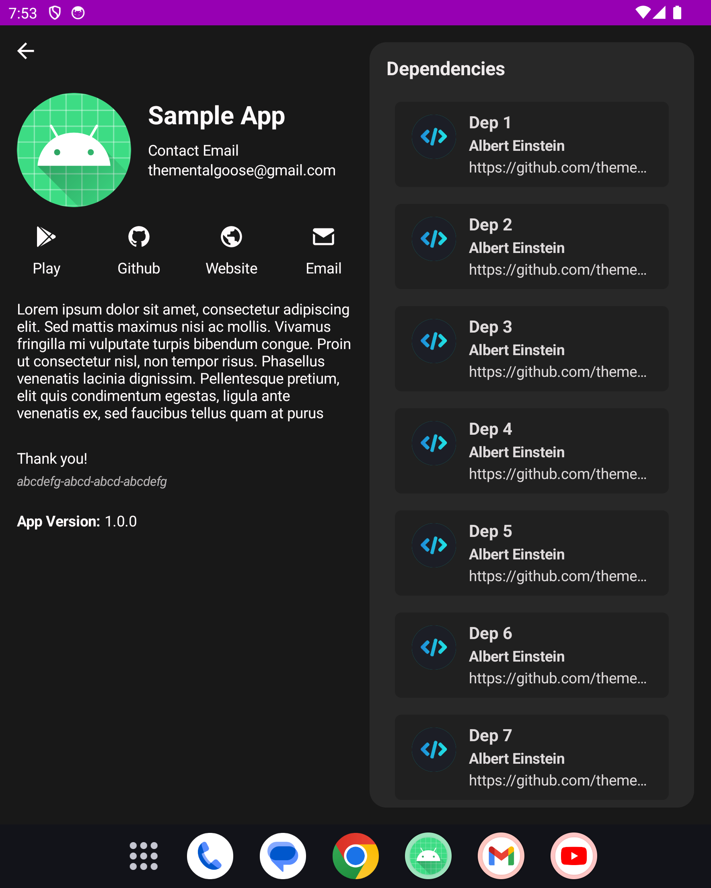

# Android About This App

The "About This App" cover screen that I use in my apps

[](https://jitpack.io/#thementalgoose/android-about-this-app) [](https://github.com/thementalgoose/android-about-this-app/actions)

| Phone                                               | Foldable                                            | Tablet                                              |
|-----------------------------------------------------|-----------------------------------------------------|-----------------------------------------------------|
|  |  |  |
|   |   |   |

## Installation

<details>
    <summary><code>build.gradle</code></summary>

    allprojects {
        repositories {
            ...
            maven { url 'https://jitpack.io' }
        }
    }
</details>

<details>
    <summary><code>app/build.gradle</code></summary>

    dependencies {
        implementation 'com.github.thementalgoose:android-about-this-app:6.0.3'
        // Use Jitpack version if newer
    }

Jitpack version: [](https://jitpack.io/#thementalgoose/android-about-this-app)
</details>

Version 6.x is a built in Jetpack Compose with a different API, so updating will cause breaking changes. See option 2 below for migrating to the new Configuration object, or stay on [5.3.2](https://github.com/thementalgoose/android-about-this-app/tree/5.3.2) to continue using the older version  

## Usage

This is now written in Jetpack Compose, and therefore can be utilised one of two ways

#### Option 1: Call the Composable

```kotlin

/**
 * Option 1
 * Consume it in a compose navigation host or your own activity
 * - Bind colours + any strings with AboutThisAppTheme
 */
setContent { 
    AboutThisAppTheme(
        lightColors = AboutThisAppColors(), /* Optional, override for custom theme */
        darkColors = AboutThisAppColors(), /* Optional, override for custom theme */
        labels = Labels() /* Optional, override for custom values / use string resources */
    ) {
        AboutThisAppScreen(
            appIcon = R.mipmap.ic_launcher,
            appName = "Sample App",
            appVersion = "1.0.0",
            dependencies = List(14) {
                Dependency(
                    dependencyName = "Library $it",
                    author = "John Doe",
                    imageUrl = "https://avatars0.githubusercontent.com/u/5982159?s=460&v=4",
                    url = "https://github.com/thementalgoose/android-about-this-app"
                )
            },
            dependencyClicked = { /* Open it.url */ },
            isCompact = windowWidthSizeClass == Compact,
            showBack = true,
            backClicked = { finish() },
            header = { 
                Text("Lorem ipsum dolor sit amet, consectetur adipiscing elit. Sed mattis maximus nisi ac mollis.")
            },
            footer = {
                Text("Thanks again!")
            },
            contactEmail = "johndoe@anonymous.com",
            links = listOf(
                Link.Github { openWebpage("https://www.github.com") },
                Link(icon = R.drawable.my_icon, name = R.string.my_name, onClick = { })
            )
        )
    }
}
```

#### Option 2: Use the activity

```kotlin
/**
 * Launch this in its own activity with a configuration object
 * - Customisation of this is more restricted.
 * - String resources should be overridden via. defining your own R.string with the same key
 * - Colours can be passed in to the configuration object via. an optional param
 */
val configuration = Configuration(
    imageRes = R.mipmap.ic_launcher,
    appName = "Sample App",
    appVersion = "1.0.0",
    dependencies = List(14) {
        Dependency(
            dependencyName = "Library $it",
            author = "John Doe",
            imageUrl = "https://avatars0.githubusercontent.com/u/5982159?s=460&v=4",
            url = "https://github.com/thementalgoose/android-about-this-app"
        )
    },
    header = "Lorem ipsum dolor sit amet, consectetur adipiscing elit. Sed mattis maximus nisi ac mollis.", /* Optional */
    footnote = "Thanks again!", /* Optional */
    appPackageName = "tmg.aboutthisapp",
    github = "https://github.com/profile/my_profile", /* Optional */
    email = "johndoe@anonymous.com", /* Optional */
    website = "https://www.google.com", /* Optional */
    debugInfo = "abcdefg-abcd-abcd-abcdefgh", /* Optional */
    lightColors = ConfigurationColours(), /* Optional */
    darkColors = ConfigurationColours(), /* Optional */
    labels = Labels(), /* Optional */
)
startActivity(AboutThisAppActivity.intent(this, configuration))
```

You may need to add a manifest entry for this activity in order for it to display in your app 

```xml
<activity 
    android:name="tmg.aboutthisapp.AboutThisAppActivity"
    android:exported="false" />
```


## License

```
Copyright (C) 2023 Jordan Fisher

Licensed under the Apache License, Version 2.0 (the "License");
you may not use this file except in compliance with the License.
You may obtain a copy of the License at

   http://www.apache.org/licenses/LICENSE-2.0

Unless required by applicable law or agreed to in writing, software
distributed under the License is distributed on an "AS IS" BASIS,
WITHOUT WARRANTIES OR CONDITIONS OF ANY KIND, either express or implied.
See the License for the specific language governing permissions and
limitations under the License.
```